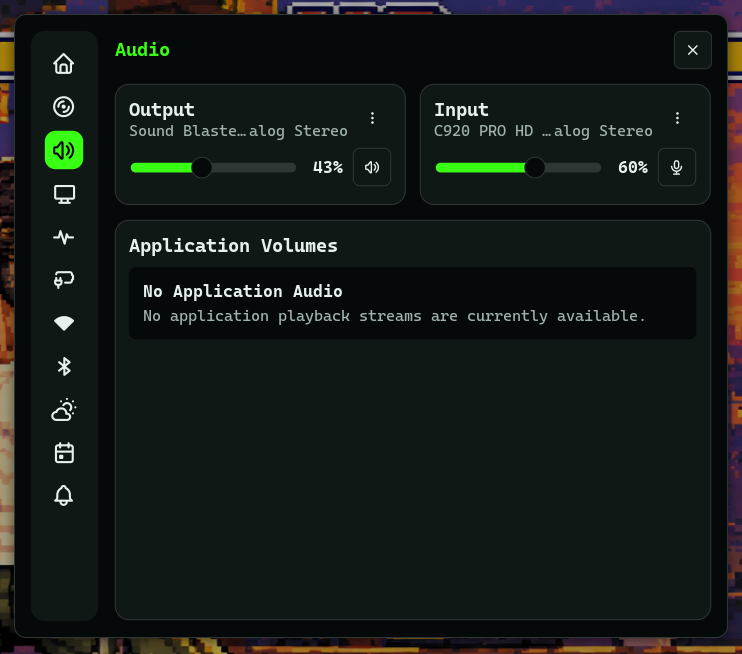
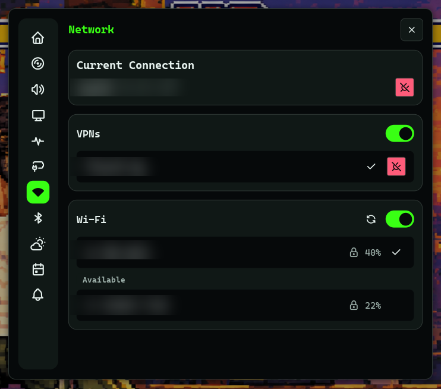
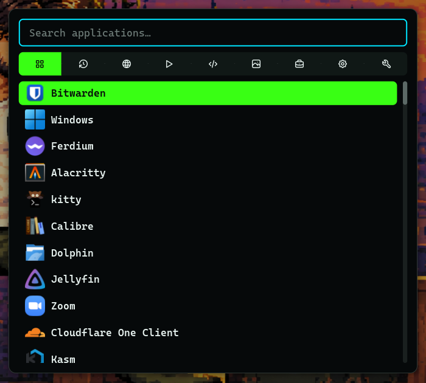

# h1n054ur theme for Noctalia

A dark, terminal-flavoured look for the [Noctalia](https://github.com/noctalia-dev/noctalia) shell: a transparent bar with floating pills, `#06090a` panels with `#1d2a26` outlines, a `#39ff14` to `#00e5ff` accent, CaskaydiaCove Nerd Font Mono everywhere, and every dropdown as its own floating card. It matches [h1n054ur-terminal](https://github.com/h1n054ur/h1n054ur-terminal).


## Two screens, two bars

I run two 1080p screens side by side, and they do different jobs:

| | Left screen (main) | Right screen |
|---|---|---|
| Workspaces | 1 to 5 | 6 to 10 |
| Bar, start | workspaces, search, clock (date on hover), weather | workspaces, Claude sessions |
| Bar, centre | window title, music (only while playing) | window title |
| Bar, end | CPU, CPU temp, GPU temp, RAM; volume, network, power | tray |

The theme file sets the **main screen's** bar as the default for every screen. The other screen gets a per-monitor override in your own `config.toml` (see below). A laptop on its own screen can get one combined bar the same way.

## The dropdowns

Every panel floats as its own dark card with a border and shadow, because the bar itself is transparent: attached panels would have nothing behind them.

| System | Audio | Network |
|---|---|---|
|  |  |  |

The launcher (Super+\` here) uses compact rows in the same font:



## What's here

| Path | What |
|---|---|
| `noctalia/h1n054ur.toml` | the theme: palette choice, bar, pills, capsule groups, widgets, floating panels, font |
| `noctalia/palettes/h1n054ur.json` | the colour palette, including terminal colours for the kitty and alacritty templates |
| `icons/glow/` | the glow icon set, recoloured green to cyan (the bar's search and power icons use it) |
| `icons/rose/` | the original rose-tinted set |
| `scripts/recolor.py` | recolours any icon folder; keeps weather icons, warm heat levels and red warning marks |

## Install

1. Install the plugins the bar uses: [noctalia-glow-plugins](https://github.com/h1n054ur/noctalia-glow-plugins) and, for the Claude widget, [noctalia-claude-sessions](https://github.com/h1n054ur/noctalia-claude-sessions).
2. Clone this repo and link the palette and icons:

```sh
git clone https://github.com/h1n054ur/noctalia-h1n054ur ~/noctalia-h1n054ur
mkdir -p ~/.config/noctalia/palettes
ln -s ~/noctalia-h1n054ur/noctalia/palettes/h1n054ur.json ~/.config/noctalia/palettes/
ln -s ~/noctalia-h1n054ur/icons/glow ~/.local/share/glow-icons
```

3. Include the theme from the top of `~/.config/noctalia/config.toml`. Anything you set in `config.toml` itself wins over the theme:

```toml
[include]
files = [ "~/noctalia-h1n054ur/noctalia/h1n054ur.toml" ]
```

4. Give the second screen its own bar. Match the screen by part of its description (`hyprctl monitors` shows it), so swapping cables never swaps the layouts:

```toml
[bar.default.monitor.right]
match = "SERIAL-OF-YOUR-RIGHT-SCREEN"
start = [ "workspaces", "claude" ]
center = [ "gw_title" ]
end = [ "tray" ]
```

## Notes

- Noctalia's bar takes one colour per fill, so the active workspace and the clock use solid `#39ff14`.
- The theme turns Noctalia's own lock screen off. Locking is done by [quickshell-h1n054ur](https://github.com/h1n054ur/quickshell-h1n054ur), which uses the same look as the login screen. Remove the `[lockscreen]` block if you want Noctalia's lock back.
- Recolour a set of your own: `scripts/recolor.py SRC DST` (add `--heat` for icons named `*-3.png`, `*-4.png` that should stay warm).

## Part of h1n054ur/desktop

This repo is generated from the `noctalia-theme/` folder of [h1n054ur/desktop](https://github.com/h1n054ur/desktop). It is read-only: open issues and pull requests there.

## Licence

MIT, see [LICENSE](LICENSE).
